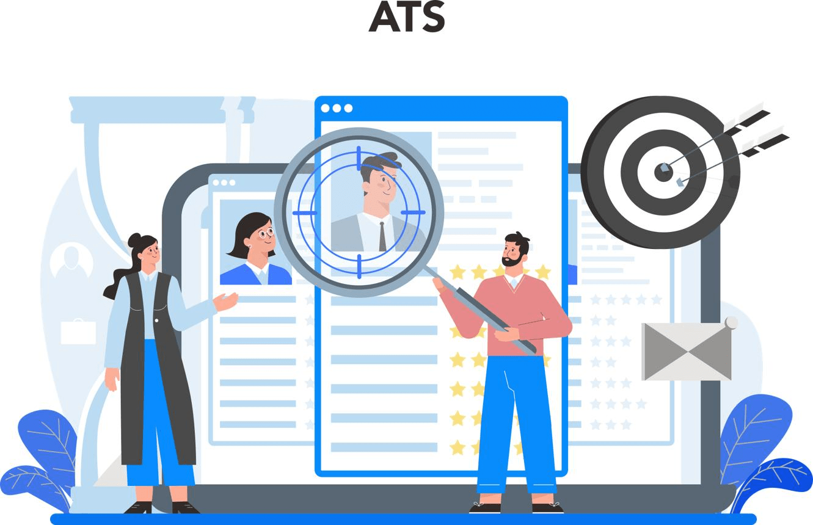
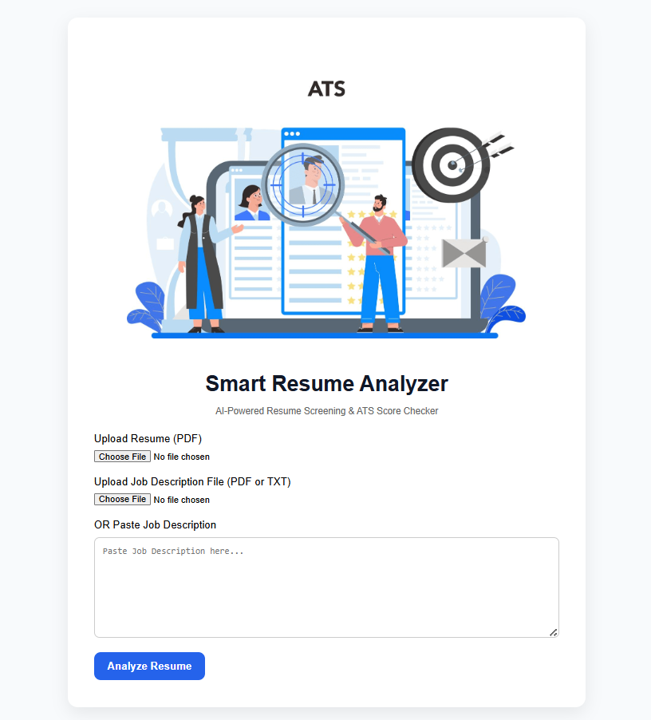
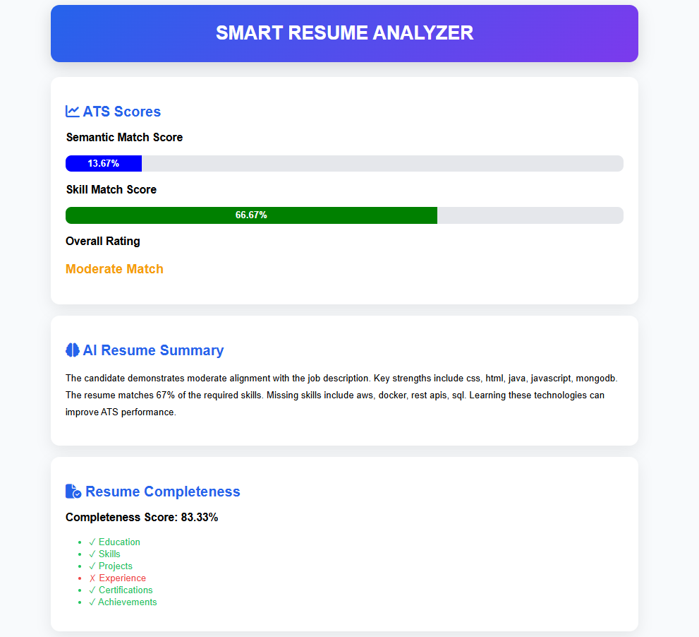
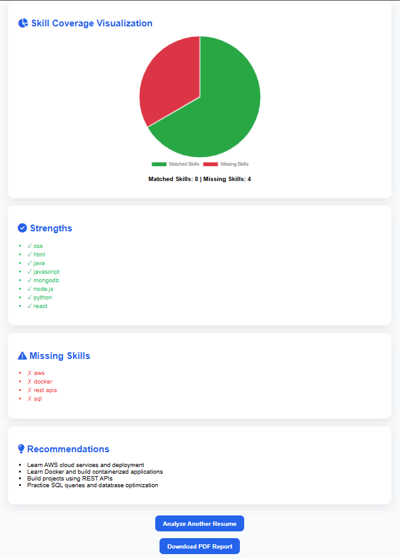
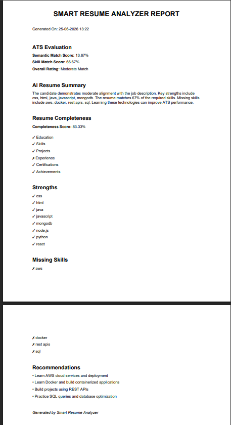

# 🚀 Smart Resume Analyzer

<p align="center">
  
</p>

<h1 align="center">📄 Smart Resume Analyzer</h1>

<p align="center">
AI-Powered Resume Screening & ATS Score Checker
</p>

<p align="center">
  
  
  
  
  
</p>

---

# 📌 Overview

Smart Resume Analyzer is an AI-assisted ATS (Applicant Tracking System) Resume Screening application built using:

- Python
- Flask
- Natural Language Processing (spaCy)
- Machine Learning (TF-IDF + Cosine Similarity)

The system compares a candidate's resume against a Job Description and generates detailed ATS insights including:

✅ ATS Match Score

✅ Semantic Similarity Score

✅ Skill Match Analysis

✅ Missing Skills Detection

✅ Resume Completeness Analysis

✅ AI Resume Summary

✅ Personalized Recommendations

✅ Professional PDF Report

This project helps job seekers understand how well their resume matches a target role and identify areas for improvement before applying.

---

# ✨ Features

## 📄 Resume & Job Description Support

- Upload Resume (PDF)
- Upload Job Description (PDF)
- Upload Job Description (TXT)
- Paste Job Description directly

---

## 🎯 ATS Analysis

- Semantic Match Score
- Skill Match Score
- Missing Skills Detection
- Strength Identification
- ATS Rating System

---

## 📊 Resume Quality Analysis

Resume Completeness Score based on:

- Education
- Skills
- Projects
- Experience
- Certifications
- Achievements

---

## 🧠 AI-Assisted Insights

- AI Resume Summary
- Personalized Recommendations
- Skill Improvement Suggestions

---

## 📈 Visualizations

- ATS Score Progress Bars
- Skill Coverage Pie Chart

---

## 📑 Reporting

- Professional PDF Report Generation
- Downloadable ATS Evaluation Report

---

# 🛠 Tech Stack

## Backend

- Python
- Flask

## NLP & Machine Learning

- spaCy
- PhraseMatcher
- TF-IDF Vectorizer
- Cosine Similarity

## Frontend

- HTML5
- CSS3
- JavaScript
- Chart.js
- Font Awesome

## PDF Generation

- ReportLab

---

# 📂 Project Structure

```text
SMART-RESUME-ANALYZER/
│
├── app.py
├── analyzer.py
├── pdf_generator.py
├── skills.csv
│
├── templates/
│   ├── index.html
│   └── results.html
│
├── static/
│   ├── style.css
│   └── resume-hero.png
│
├── screenshots/
│
└── README.md
```

---

# ⚙️ Installation

## Clone Repository

```bash
git clone https://github.com/Harsha-madikonda/SMART-RESUME-ANALYZER.git

cd SMART-RESUME-ANALYZER
```

---

## Create Virtual Environment

```bash
python -m venv venv
```

---

## Activate Environment

### Windows

```bash
venv\Scripts\activate
```

### Linux / Mac

```bash
source venv/bin/activate
```

---

## Install Dependencies

```bash
pip install -r requirements.txt
```

---

## Download spaCy Model

```bash
python -m spacy download en_core_web_sm
```

---

## Run Application

```bash
python app.py
```

Application will run at:

```text
http://127.0.0.1:5000
```

---

# 🔄 Workflow

### Step 1

Upload Resume PDF

⬇️

### Step 2

Upload Job Description
OR
Paste Job Description

⬇️

### Step 3

Analyze Resume

⬇️

### Step 4

View ATS Scores

⬇️

### Step 5

Review Missing Skills

⬇️

### Step 6

Read AI Resume Summary

⬇️

### Step 7

Download PDF Report

---

# 📷 Screenshots

## 🏠 Home Page



---

## 📊 ATS Analysis Dashboard



---

## 🥧 Skill Coverage Visualization



---

## 📑 PDF Report



---

# 🚀 Future Improvements (Version 2)

Current version uses traditional NLP + ML techniques.

Future AI-powered upgrades:

### 🤖 Advanced AI Matching

- Sentence Transformers
- BERT Embeddings
- Semantic Skill Matching

### 🧠 LLM Integration

- OpenAI GPT Integration
- AI Resume Feedback
- Resume Rewriting Suggestions

### 🎯 Career Intelligence

- Interview Readiness Score
- Career Path Recommendations
- Job Fit Prediction

### 📈 Advanced ATS Engine

- Keyword Weighting
- Experience Scoring
- Education Scoring
- Recruiter Style ATS Ranking

---

# 🎓 Learning Outcomes

Through this project, I gained practical experience in:

- Natural Language Processing (NLP)
- Resume Parsing
- Semantic Text Similarity
- Flask Web Development
- Machine Learning Fundamentals
- PDF Report Generation
- Frontend Dashboard Design
- Data Visualization
- AI-Assisted Recommendation Systems

---

# 👨‍💻 Author

## Harshavardhan Madikonda

Computer Science Engineering Student

Interested in:

- Artificial Intelligence
- Machine Learning
- NLP
- Full-Stack Development
- Data Science

### GitHub

🔗 https://github.com/Harsha-madikonda

---

# ⭐ Support

If you found this project useful:

⭐ Star the repository

🍴 Fork the project

📢 Share with others

---

<p align="center">
Made with ❤️ using Python, Flask, NLP & Machine Learning
</p>