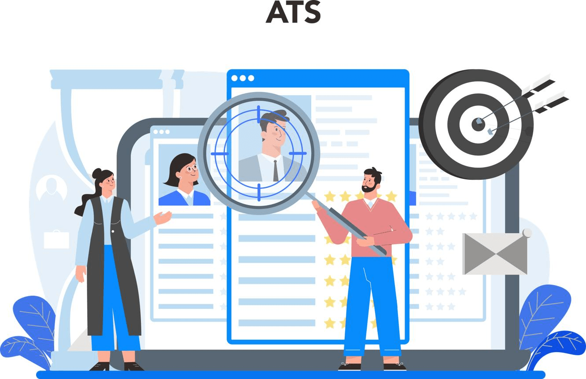

# 🚀 Smart Resume Analyzer

<p align="center">
  
</p>

<h1 align="center">📄 Smart Resume Analyzer</h1>

<p align="center">
  AI-Powered Resume Screening, Career Preparation & Placement Practice Platform
</p>

<p align="center">
  <a href="https://smart-resume-analyzer-9n9g.onrender.com/">
    🌐 Live Demo
  </a>
  |
  <a href="https://github.com/Harsha-madikonda/SMART-RESUME-ANALYZER">
    💻 GitHub Repository
  </a>
</p>

<p align="center">
  
  
  
  
  
</p>

---

## 📌 Overview

**Smart Resume Analyzer** is an AI-assisted career preparation and resume screening web application built using Python, Flask, Natural Language Processing (NLP), and Machine Learning techniques.

The application helps job seekers evaluate their resumes, identify missing skills, assess their career readiness, practise technical questions, and prepare for placement interviews.

It combines resume analysis with career-specific learning recommendations in one platform.

## ✨ Key Features

### 📄 1. Resume Analyzer & ATS Score

* Upload a resume in PDF format.
* Upload a Job Description (JD) in PDF or TXT format.
* Paste a Job Description directly into the application.
* Calculate resume-to-job matching scores.
* Analyze matched and missing skills.
* Identify resume strengths and areas for improvement.
* Generate a resume summary and personalized recommendations.
* Download a professional PDF evaluation report.

### 🎯 2. Career Preparation & Skill Gap Analysis

A personalized career preparation feature that helps users prepare for their target job role.

* Select a career path:

  * Full Stack Developer
  * AI/ML Engineer
  * Software Engineer
* Analyze skills identified from the uploaded resume.
* Compare existing skills with the requirements of the selected career.
* Identify skills that need improvement.
* Calculate a career readiness percentage.
* View a structured learning roadmap.
* Update known skills and track readiness.
* Navigate to practice questions to strengthen missing skills.

**Goal:** Help users understand their skill gaps and follow a more focused preparation plan for their chosen career.

### 📝 3. Practice Tests

Practise questions to improve technical knowledge and placement readiness.

* Multiple question categories.
* Difficulty selection: Easy, Medium, and Hard.
* Programming and technical practice.
* Aptitude questions.
* Computer Science subjects such as DBMS, Operating Systems, and Computer Networks.
* Interactive question-solving experience.

### 🎤 4. Mock Interview

Practise interview questions in a simulated interview environment.

* Select a target job role.
* Choose an interview difficulty level.
* Practise common HR and role-specific technical questions.
* Answer questions through an interactive interface.
* Track interview progress and time.
* Receive scores and answer feedback.
* Review matched keywords and improvement suggestions.
* Get feedback appropriate to different interview question types.

### 📊 5. Resume Quality Analysis

Evaluate resume completeness by detecting important sections, including:

* Education
* Skills
* Projects
* Experience
* Certifications
* Achievements

### 📑 6. Reports & Visualizations

* ATS score progress indicators.
* Skill coverage visualization.
* Resume evaluation summary.
* Missing-skill recommendations.
* Downloadable PDF report.

---

## 🛠️ Technology Stack

| Component        | Technologies                        |
| ---------------- | ----------------------------------- |
| Backend          | Python, Flask                       |
| NLP              | spaCy, PhraseMatcher                |
| Machine Learning | TF-IDF, Cosine Similarity           |
| Frontend         | HTML5, CSS3, JavaScript             |
| Visualization    | Chart.js                            |
| Icons            | Font Awesome                        |
| PDF Generation   | ReportLab                           |
| Data Storage     | JSON question banks, CSV skill data |

---

## 📂 Project Structure

```text
SMART-RESUME-ANALYZER/
│
├── app.py
├── analyzer.py
├── pdf_generator.py
├── skills.csv
├── requirements.txt
│
├── data/
│   ├── practice_questions.json
│   └── interview_questions.json
│
├── templates/
│   ├── index.html
│   ├── results.html
│   ├── career.html
│   ├── career_detail.html
│   ├── practice.html
│   └── interview.html
│
├── static/
│   ├── style.css
│   ├── career.css
│   └── resume-hero.png
│
├── screenshots/
│
└── README.md
```

*Note: The structure above describes the main project files; additional files may exist in the repository.*

---

## ⚙️ Installation & Setup

### 1. Clone the Repository

```bash
git clone https://github.com/Harsha-madikonda/SMART-RESUME-ANALYZER.git
cd SMART-RESUME-ANALYZER
```

### 2. Create a Virtual Environment

```bash
python -m venv venv
```

### 3. Activate the Environment

**Windows**

```bash
venv\Scripts\activate
```

**Linux / macOS**

```bash
source venv/bin/activate
```

### 4. Install Dependencies

```bash
pip install -r requirements.txt
```

### 5. Download the spaCy Language Model

```bash
python -m spacy download en_core_web_sm
```

### 6. Run the Application

```bash
python app.py
```

Open your browser and visit:

```text
http://127.0.0.1:5000
```

---

## 🔄 Application Workflow

### Resume Analysis

1. Upload your resume.
2. Upload or paste a Job Description.
3. Analyze the resume.
4. Review matching scores and resume completeness.
5. Identify missing skills.
6. Read the summary and recommendations.
7. Download the PDF report.

### Career Preparation

1. Open Career Preparation.
2. Select your target career.
3. Upload or analyze your resume as required by the feature.
4. Review detected skills and missing skills.
5. Check your career readiness percentage.
6. Follow the recommended learning roadmap.
7. Practise the skills you need to improve.

### Practice Tests & Mock Interviews

1. Open Practice Tests or Mock Interview.
2. Select the appropriate category, career role, or difficulty.
3. Answer the questions.
4. Review your score, feedback, and suggestions.
5. Practise again to improve your preparation.

---

## 🌐 Live Demo

**Try the deployed application:**

👉 https://smart-resume-analyzer-9n9g.onrender.com/

**Source Code:**

👉 https://github.com/Harsha-madikonda/SMART-RESUME-ANALYZER

*Note: The live demo requires a successful deployment and may take some time to respond if the hosting service is idle.*

---

## 🚀 Future Enhancements

Potential improvements for future versions include:

* Transformer-based semantic resume matching.
* Advanced AI-powered resume feedback.
* Automated resume rewriting suggestions.
* More career paths and expanded skill databases.
* Adaptive practice questions based on individual skill gaps.
* More detailed interview performance analytics.
* Personalized learning recommendations.
* Progress history and user accounts.

---

## 🎓 Learning Outcomes

This project provides practical experience in:

* Python and Flask web development.
* Natural Language Processing.
* Resume parsing and skill extraction.
* TF-IDF and cosine similarity.
* Machine Learning fundamentals.
* Interactive frontend development.
* JSON-based question-bank management.
* PDF report generation.
* Career readiness and skill-gap analysis.
* Building an integrated career preparation application.

---

## 👨‍💻 Author

**Harshavardhan Madikonda**

Computer Science Engineering Student

Interested in Artificial Intelligence, Machine Learning, NLP, and Full-Stack Development.

* **GitHub:** https://github.com/Harsha-madikonda
* **LinkedIn:** https://www.linkedin.com/in/madikondaharshavardhan/

---

## ⭐ Support

If you find this project useful:

* ⭐ Star the repository.
* 🍴 Fork the project.
* 📢 Share it with others.

<p align="center">
  Made with ❤️ using Python, Flask, NLP & Machine Learning
</p>
